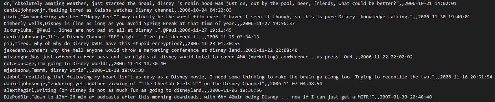

# Graduation Thesis - Применение  методов оценки тональности текстов для предсказания поведения финансовых рынков
* **сбор твитов:**
Т.к. не удалось получить доступ к Twitter API, я вопользовался проектом, который даёт возможность получить твиты без него
[GetOldTweets-python](https://github.com/Jefferson-Henrique/GetOldTweets-python)

* **датасеты**
Пример датасета для компании Disney. Сами датасеты из-за их большого размера находятся на Google Disk

